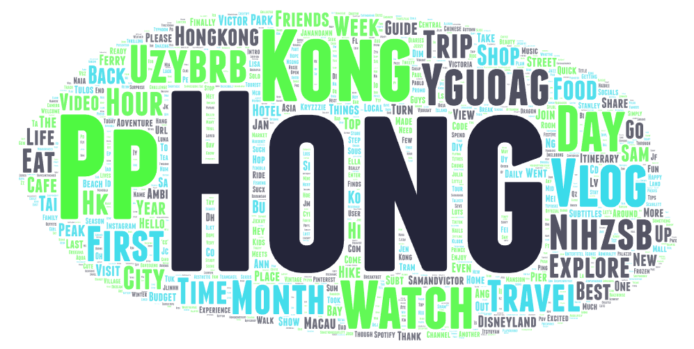

# GEOG 458 Lab 2: Web Data Collection and Visualization

## Writeup

The topic in this research lab is to collect interest and general sentiment on the travel trends for the city Hong Kong. I used the terms "hk vlog", "hong kong vlog" and "hong kong travel vlog" to visualize and compare the focus and frequency of topics and terms within the content of various vlogs related to Hong Kong, which is a good way to see the general trends of what people are interested in when it comes to Hong Kong.

The reason for making this comparison is to understand how the change in search parameters can influence the content that is highlighted or associated with the given research topic. By adjusting the search terms, we can see how the common words can change, which in turn can reflects what content it might be present with the given search terms.

Upon comparing the word clouds, we can see certain general similarities and differences. Common terms link "Hong," "Travel," "Vlog," "Day," "Food" appear prominently across all three, aligning with the research topic. However, some certain words like "Disneyland" and "Guide" can indicates a shift in focus depending on the specificity of the search term used.

The patterns observed could be due to several reasons. The broader search like "hk vlog" might capture a general content array, or it can be due to the fact that the term "hk" can mean in different way, while "hong kong vlog" might refine the search to be more specific content related to the research topic.

Ways to improve this research could be to use more specific search terms, or to use more search terms to compare, or to use a more robust text analysis method that considers not just the frequency of words, but also the context and meaning of the words.

In terms of unexpected findings, it is interesting to note the appearance of word like "Disneyland," which suggests a significant interest in the theme park. It is also interesting to see the word "Guide" appear in the third word cloud, which suggests that people are interested in travel guides for Hong Kong.

## Word Cloud Images

## Links to Source Data

[Word Cloud 1](./assets/search-result-1.csv)
[Word Cloud 2](./assets/search-result-2.csv)
[Word Cloud 3](./assets/search-result-3.csv)